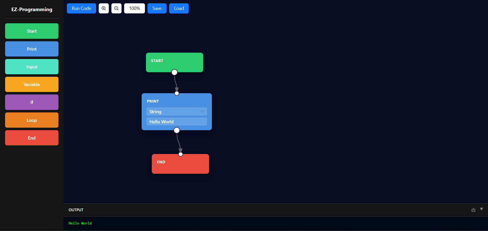

# EZ-Programming

A visual programming interface that allows users to create programs by dragging and connecting nodes on a canvas. Built with React, Vite, Ant Design, and Tailwind CSS for an intuitive and powerful programming experience. Translates visual programs to Python code in real-time.



## Features

- **Visual Node-Based Programming**: Create programs by dragging nodes onto a canvas and connecting them with directional arrows
- **Real-time Python Translation**: Automatically generates Python code as you build your visual program
- **Multiple Node Types**:
  - **Start**: Program entry point
  - **Print**: Output text or expressions to the terminal (supports string and expression modes)
  - **Input**: Get user input with custom prompts
  - **Variable**: Store and manipulate data (strings and numbers)
  - **If**: Conditional branching with true/false paths (auto-quotes string literals)
  - **Loop**: Iterative execution (count-based and while loops)
  - **End**: Program termination
- **Interactive Canvas**: Zoom, pan, and navigate the programming workspace with smooth controls
- **Dual Execution**: Both execute programs and view generated Python code simultaneously
- **Python Code Viewer**: Collapsible right sidebar displays generated Python code with proper indentation
- **Real-time Terminal**: Integrated output terminal showing program execution results
- **Save/Load Projects**: Persist your programs as `.ez` JSON files
- **Dark Theme UI**: Modern, eye-friendly interface built with Ant Design and Tailwind CSS
- **Context Menus**: Right-click nodes for quick actions like deletion
- **Keyboard Shortcuts**: Press Delete key to remove selected nodes

## Installation

### Prerequisites

- Node.js (v16 or higher)
- npm or yarn

### Setup

1. Clone the repository:

   ```bash
   git clone https://github.com/alibadawi25/EZ-Programming.git
   cd EZ-Programming
   ```

2. Install dependencies:

   ```bash
   npm install
   ```

3. Start the development server:

   ```bash
   npm run dev
   ```

4. Open your browser and navigate to `http://localhost:5173`

## Usage

### Creating a Program

1. **Add Nodes**: Drag node types from the left sidebar onto the canvas
2. **Connect Nodes**: Click on output ports (bottom) of nodes and then input ports (top) to create connections
3. **Configure Nodes**: Click on nodes to edit their properties (text, conditions, expressions, etc.)
4. **View Python Code**: Click the arrow button on the right edge to toggle the Python code viewer
5. **Execute**: Click the "Run Code" button to execute your program and see output in the terminal

### Node Types Guide

#### Basic Nodes

- **Start**: Marks the beginning of your program. Generates `# Program Start` comment in Python.
- **Print**: Outputs text or variable values to the terminal.
  - **String mode**: Wraps text in quotes: `print("text")`
  - **Expression mode**: Evaluates variables and expressions: `print(variable + 5)`
- **Input**: Prompts for user input with custom messages: `variable = input("Enter value: ")`
- **Variable**: Stores data that can be used throughout your program. Auto-quotes strings in Python: `name = "value"` or `count = 42`
- **End**: Marks the end of your program. Generates `# Program End` comment in Python.

#### Control Flow Nodes

- **If**: Creates conditional branches with proper Python syntax.
  - Automatically quotes string literals in conditions: `if sign == "+"`
  - Generates `else:` blocks for false branches
  - Properly indents nested code blocks
- **Loop**: Supports both count-based and condition-based loops with proper indentation.
  - **Count mode**: `for _ in range(n):`
  - **While mode**: `while condition:`
  - Includes "body" (loop content) and "exit" (after loop) paths

### Canvas Controls

- **Zoom In/Out**: Use the +/- buttons to zoom in/out
- **Pan**: Right-click and drag to pan around the canvas
- **Reset Zoom**: Click the percentage button to reset to 100%
- **Python Code Viewer**: Click the arrow (←/→) button on the right edge to show/hide Python code

### Saving and Loading

- **Save**: Click "Save" to download your program as a `.ez` file (JSON format)
- **Load**: Click "Load" to import a previously saved program
- **Project Name**: Edit the project name at the top of the left sidebar

### Python Code Generation

The Python code is automatically generated as you build your program:

- Proper indentation for nested blocks (if/else, loops)
- Automatic string quoting in conditions and variables
- Clean, readable Python syntax
- Comments for Start and End nodes

## Examples

### Hello World Program

1. Add a Start node
2. Add a Print node and connect Start → Print
3. Configure Print node with message "Hello, World!"
4. Add an End node and connect Print → End
5. Click "Run Code" to see the output

### Simple Calculator

1. Add Start → Input (get first number) → Variable (store first number)
2. Add Input (get second number) → Variable (store second number)
3. Add Print nodes for calculations and results
4. Connect to End node

### Conditional Logic

1. Add Input → Variable (get user input)
2. Add If node connected to the variable
3. Create different paths for true/false conditions
4. Add Print nodes for each path

## Project Structure

```
src/
├── App.jsx          # Main application component with layout and state management
├── Components/
│   ├── Node.jsx     # Node component definitions and configurations
│   ├── Block.jsx    # Common block functionality
│   └── layout.jsx   # Layout utilities
├── executor.js      # Program execution engine (runs visual programs)
├── translator.js    # Python code generator (translates nodes to Python)
├── App.css          # Application styles
├── index.css        # Global styles with Tailwind
└── main.jsx         # Application entry point
```

## Contributing

Contributions are welcome! Please feel free to submit a Pull Request.

1. Fork the repository
2. Create your feature branch (`git checkout -b feature/AmazingFeature`)
3. Commit your changes (`git commit -m 'Add some AmazingFeature'`)
4. Push to the branch (`git push origin feature/AmazingFeature`)
5. Open a Pull Request

## License

This project is licensed under the MIT License - see the [LICENSE](LICENSE) file for details.

## Technologies Used

- **React**: UI framework for building the interface with hooks (useState, useRef, useEffect)
- **Vite**: Fast build tool and development server
- **Ant Design**: UI component library for buttons, layout, and inputs
- **Tailwind CSS**: Utility-first CSS framework for responsive styling
- **SVG**: For rendering connection arrows and canvas elements
- **JavaScript ES6+**: Modern JavaScript features including classes and arrow functions

## Future Enhancements

- [ ] Function nodes for reusable code blocks
- [ ] Array and object data types
- [ ] Advanced loop constructs (for-each, do-while)
- [ ] Error handling and debugging tools
- [ ] Export to additional languages (JavaScript, Java, C++)
- [ ] Syntax highlighting in Python code viewer
- [ ] Copy to clipboard for generated code
- [ ] Collaborative editing features
- [ ] Plugin system for custom node types
- [ ] Undo/redo functionality
- [ ] Multi-line input support
- [ ] Variable inspector/debugger

## Authors

- **Ali Badawi - alibadawi25**
- **Youssef Tamer - waryoyo**
- **Hamed A. Elgizery - HamedElgizery**
- **Ahmed Hisham - jvgcgch**
- **Youssef Ahmed**

---

Made with ❤️ for visual programming enthusiasts
